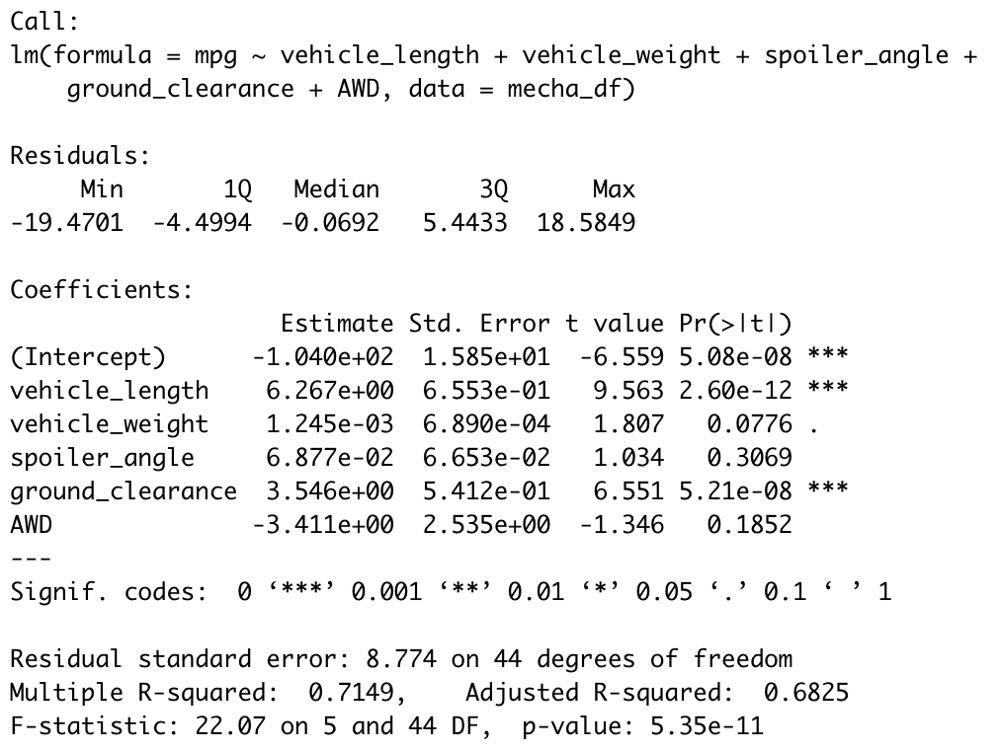
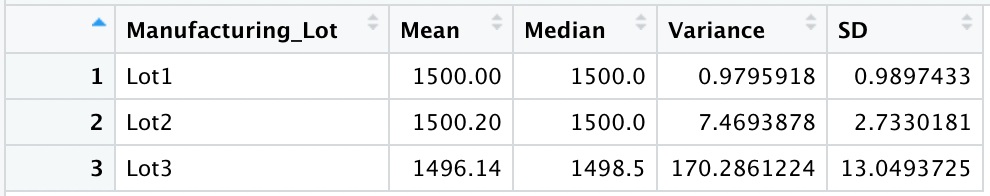
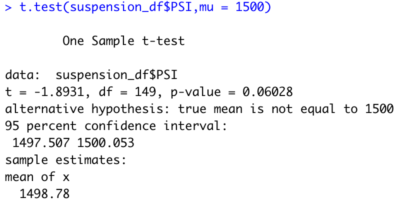
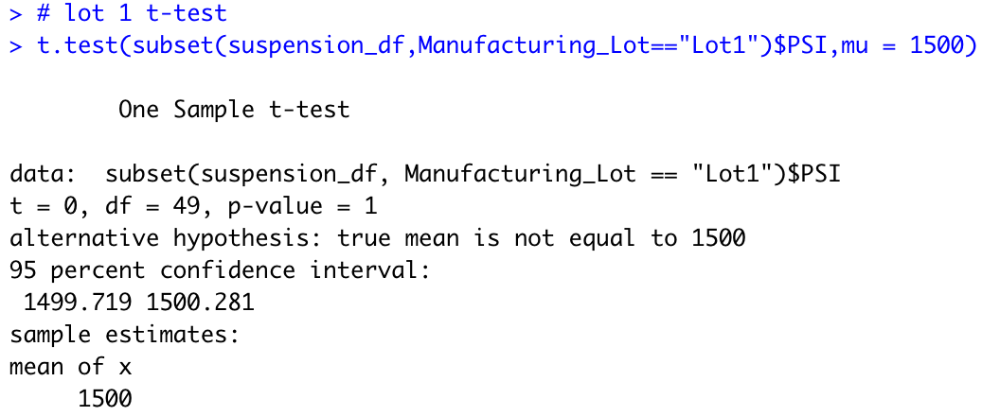
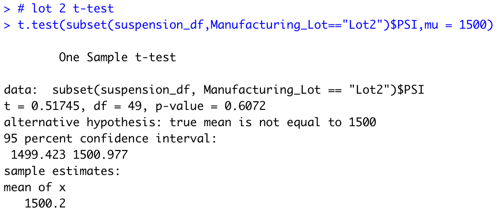
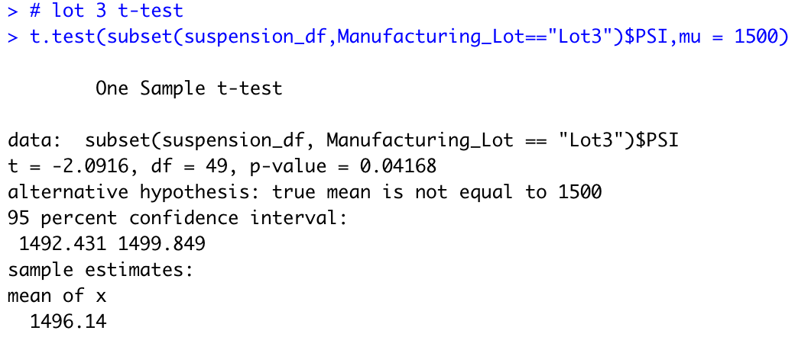

# MechaCar_Statistical_Analysis

## Purpose
- Perform multiple linear regression analysis to identify which variables in the dataset predict the mpg of MechaCar prototypes
- Collect summary statistics on the pounds per square inch (PSI) of the suspension coils from the manufacturing lots
- Run t-tests to determine if the manufacturing lots are statistically different from the mean population
- Design a statistical study to compare vehicle performance of the MechaCar vehicles against vehicles from other manufacturers. For each statistical analysis, you’ll write a summary interpretation of the findings.

## Linear Regression to Predict MPG

After analyzing the MechaCar MPG dataset and summary statistics, the following conclusions can be made:
- 'vehicle_length' and 'ground_clearance provide a non-random amount of variance to the mpg values
- The slope of the linear model is not considered zero because the p-value of 5.35e-11 (screenshot below) is less than 0.5
- This linear model does predict the MechaCar MPG for prototypes because the R-Squared value is ~0.72 (screenshot blow)

***Summary Statistics***

## Summary Statistics on Suspension Coils
The design specifications for the MechaCar suspension coils dictate that the variance of the suspension coils must not exceed 100 pounds per square inch. When looking at the suspension coil data in summary, it appears as though all lots pass the requirement. The variance for all lots, ~62.3 (screenshot below) is below the 100psi requirement.

***Total Suspension Coil Summary***

When analyzing the lot specific summary statistics, only Lot1 and Lot2 meet the requirements. Lot3 is ~70.3psi greater than the allowed variance of 100psi (screenshot below)

***Suspension Coil by Lot Summary***

## T-Tests on Suspension Coils
Using your knowledge of R, perform t-tests to determine if all manufacturing lots and each lot individually are statistically different from the population mean of 1,500 pounds per square inch.
Below is an analysis comparing the performance of the MechaCar vehicles against performance of vehicles from other manufacturers.

***Suspension Coil T-Test - All***

The T-Test for all lots suggests we do not have enough evidence to reject the null hypothesis as the p-value is above 0.05.

***Suspension Coil T-Test - Lot 1***

The T-Test for all lots suggests we do not have enough evidence to reject the null hypothesis as the p-value is above 0.05. 

***Suspension Coil T-Test - Lot 2***

The T-Test for all lots suggests we do not have enough evidence to reject the null hypothesis as the p-value is above 0.05. 

***Suspension Coil T-Test - Lot 3***

The T-Test for all lots suggests we have enough evidence to reject the null hypothesis as the p-value is below 0.05. 

## Study Design: MechaCar vs Competition
Using your knowledge of R, design a statistical study to compare performance of the MechaCar vehicles against performance of vehicles from other manufacturers.

What metric or metrics are you going to test?
- In an age where the impacts of climate change can be felt and seen, many governments are cracking down on ways to reduce our emissions. One major policy is a push to electric cars. I would love to see the MechaCar compared to top performing electric cars and specifically compare range, acceleration, maintenance, average price, and eMPG.

What is the null hypothesis or alternative hypothesis?
- **Null Hypotheseis:** there is no range difference between MechaCar and the electric car top performers.

- **Alternative Hypothesis:** there is a range difference between MechaCar and the electric car top performers.

What statistical test would you use to test the 
hypothesis? And why?
- In order to statistically test my hypothesis I would use a two sample t-test to see if there are any diffferences between the distribution means of the MechaCar metrics vs the electric car metrics.

What data is needed to run the statistical test?
- In order to run this analysis I need access to range data for the MechaCar and the top electric car performers.